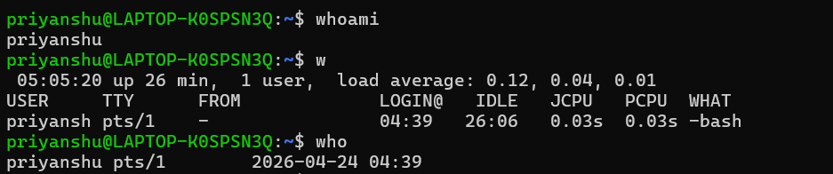
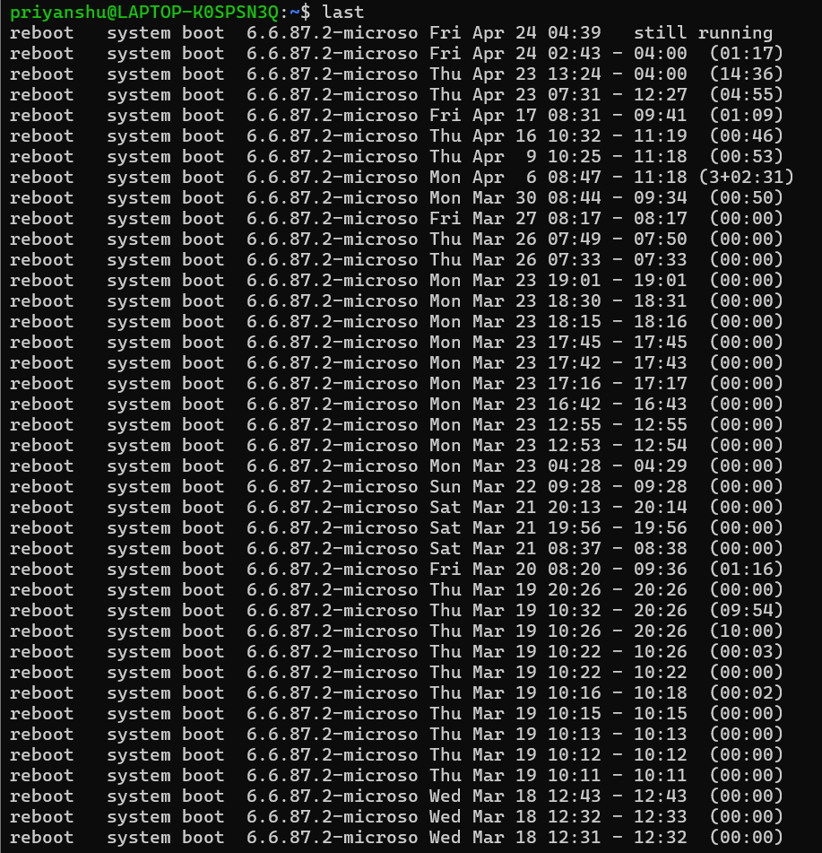
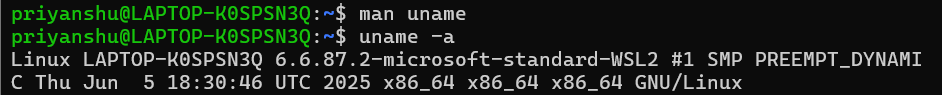
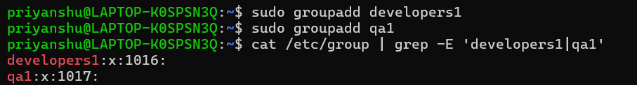
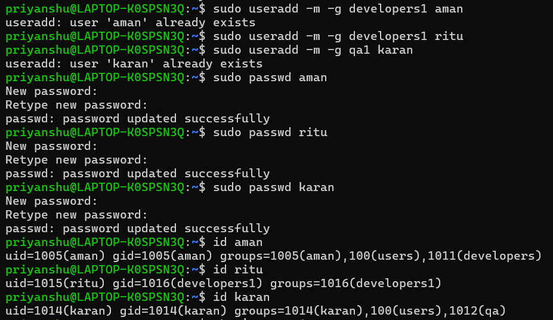
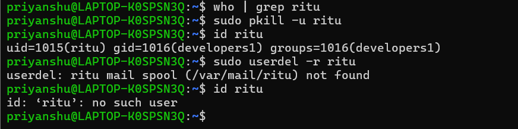

## 1-Check the identity of the currently logged-in user and display the username of the current session.

## 2-Check which users are currently logged into the system and what they are doing.

## 3-View the login history of the system.

## 4-Display complete system information, the hostname, and how long the system has been running.

## 5-Create two groups: developers and qa. Verify both groups were successfully created and display the complete list of groups on the system.

## 6-Create the following users and assign each to their respective group:
| Employee | Department |
|----------|-----------|
| Aman     | Developers|
| Ritu     | Developers|
| Karan    | QA        |

## 7-Employee ritu has resigned. Ensure she has no active sessions, delete her account along with her home directory, and verify she no longer exists on the system.

