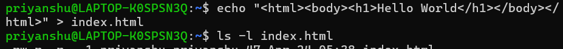
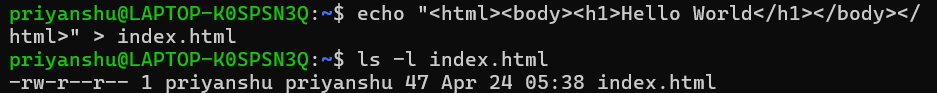
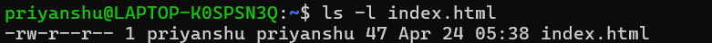
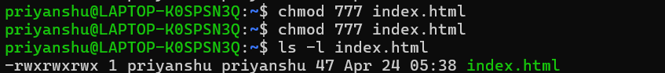
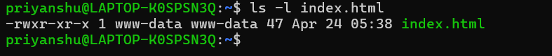

## 1-Navigate to your home directory and create a file named index.html.

## 2-Add any HTML text content to the file. 

## 3-Check the file's current default permissions.

## 4-Grant full permissions (read, write, execute) to all users on the file.

## 5-Change the file owner and group to www-data.

## 6-Change the file permissions to 755.

## 7-Display the final permissions and ownership to verify the configuration.
