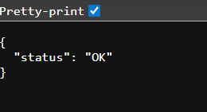

## 1-Initialize a new Node.js project and install the required dependencies: express and @types/express (as a dev dependency).
```bash 
mkdir nodejs-api
cd nodejs-api
npm init -y

npm install express
npm install --save-dev @types/express
```
## 2-Create an index.js file that starts an Express server on port 8080 with the following endpoint:
   GET /health — returns HTTP status 200 with the JSON response { "status": "OK" }.

```bash
touch index.js


CODE:-
const express = require('express');
const app = express();

app.get('/health', (req, res) => {
  res.status(200).json({ status: "OK" });
});

const PORT = 8080;
app.listen(PORT, () => {
  console.log(`Server running on port ${PORT}`);
});


node index.js

```


## 3-Initialize a Git repository in the project folder.
```bash
git init
```

## 4-Create an initial commit with all project files.
```bash 
 touch .gitignore 
```


## 5-Create a GitHub repository named nodejs-api and push your code to it.

```bash 
git init

git remote add origin https://github.com/priyansh-singh-1/devops-Mse2.git

git add .

git commit -m "Initial commit: Node.js API setup"

git branch -M main

git push -u origin main
```
